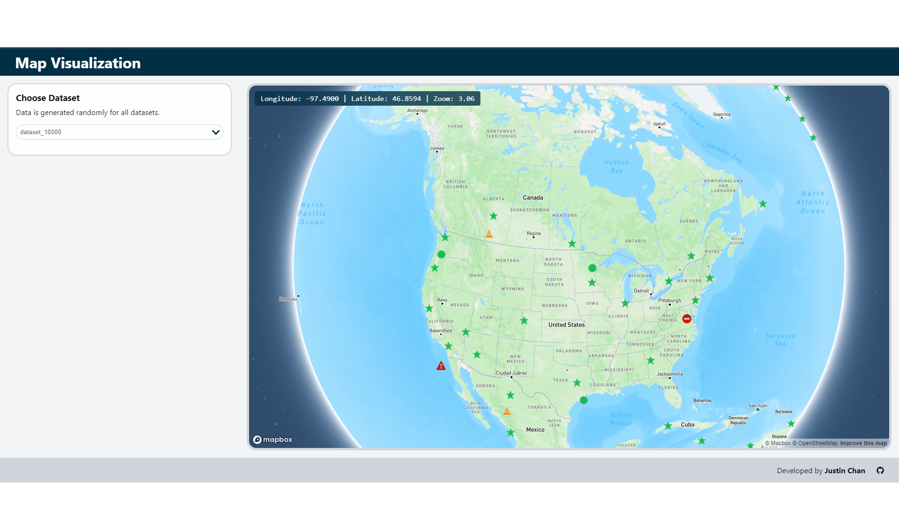
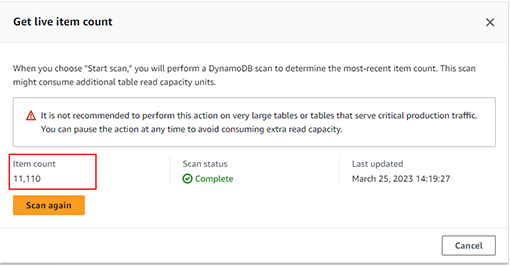
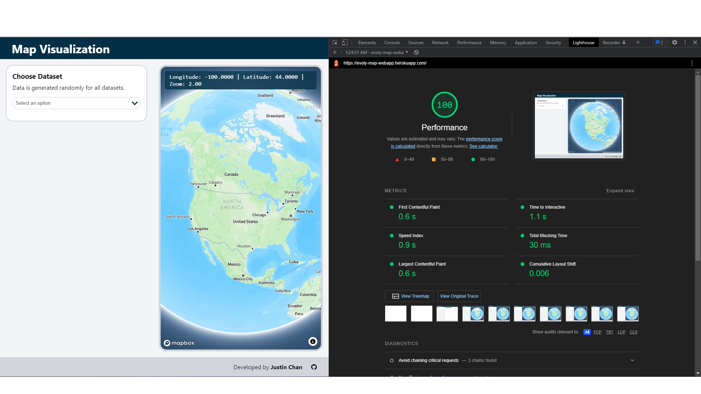

# Evoly-Map-WebApp

This is a typescript react-frontend, express-backend web application (monorepo) that uses mapbox-gl to display icons on coordinates fetched from different datasets in a dynamoDB table.

The live production site can be viewed [here](https://evoly-map-webapp.herokuapp.com/).

## Table of contents
1. [Development](#development)
2. [Deployment](#deployment)
3. [Project Details](#project-description)
4. [Improvements](#out-of-scope-improvements)
5. [Attributions](#attributions)


# Development

## Requirements:
- Node (v.18.x recommended)
- npm (v.9.x recommended)
- aws account and `AWS_ACCESS_KEY_ID`, `AWS_SECRET_ACCESS_KEY` from IAM user with `AmazonDynamoDBFullAccess` permissions
- mapbox account and public access token `REACT_APP_MAPBOX_TOKEN` with **only public scopes**
- heroku account (for production deployment only)

## Getting started

- clone the repository with `git clone https://github.com/jrchan84/Evoly-Map-WebApp.git` or with ssh

***Environmental Variables***

- Create your own accounts and add your tokens and secrets to your machines environmental variables
    - `AWS_ACCESS_KEY_ID` 
    - `AWS_SECRET_ACCESS_KEY` 
        - AWS tokens should be from an IAM user created for this project, and with limited necessary permissions.
    - `REACT_APP_MAPBOX_TOKEN` **Note**: This **public** token **will** be exposed in the client (although obscured through minification). This is safe and necessary, and can be url restricted / rotated to prevent malicious usage in your MapBox account. While possible to proxy requests through the server, it is against MapBox's [product terms](https://www.mapbox.com/legal/product-terms).

[MacOS Guide](https://support.apple.com/en-ca/guide/terminal/apd382cc5fa-4f58-4449-b20a-41c53c006f8f/mac), 
[Windows Guide](https://learn.microsoft.com/en-us/windows-server/administration/windows-commands/set_1), 
[Linux Guide](https://www.serverlab.ca/tutorials/linux/administration-linux/how-to-set-environment-variables-in-linux/)

**Note**: You may need to restart shells for environmental variables to become available depending if you use temporary or persisted variables.

***Generating Data***

The project includes a javascript file that uses the AWS Javascript v2 SDK to create a new DynamoDB table, and populate it with 4 datasets of randomly generated data. To make the data seem more realistic, they are populated within a random radius [0, 1.5 degrees] of major cities. The AWS SDK automatically picks up credentials from your environmental variables. The script also uses the region **us-west-2**: If you'd prefer a different region, change the line `const REGION = "us-west-2";`

- navigate to the repository `cd REPOSITORY-NAME`
- run `npm install` to install dependencies. This will also install the rest of the project's dependencies, and also run webpack to bundle files. This may take a few minutes.
- navigate to the script `cd db_utils`
- run `node generateDataScript.js`. This will take a moment, wait for the script to finish. Afterwards, check that your DynamoDB is populated in your AWS Console.



***Development environment***

- navigate to the project's root directory.
- run `npm run dev` to start the application in development mode locally
- navigate to `http://localhost:3000/` to see the webapp. **Note:** make sure port 3000 is not used by other processes.
- you can hit the express endpoints with `http://localhost:3000/api/datasets` and `http://localhost:3000/api/datasets/<dataset_id>`

`npm run dev` uses nodemon and webpack to compile and bundle the code, and watch for changes. Server-side changes will automatically restart the Express server, but you will need to refresh the browser for React changes.

You can use `npm run start` for running 'production' locally, which serves the built files in `dist/server.js` and `public/js/app.js`. However unless `NODE_ENV` is set to production, webpack will still run in development mode and source-maps will be available.

# Deployment
This section is for if you want to deploy the production application to Heroku.

- Create a heroku account and a new node.js project.
- Connect the project to your github repository.
- Set environment variables in the heroku app's config vars.
- Manually deploy the application, or set up automatic deployments on code pushes. It is recommended to use a seperate branch like `release` for your deployments.

Heroku automatically uses `NODE_ENV=production`. This means that webpack will bundle and minify our source code in production mode and without any source maps. Another thing to mention is our express server uses the `compression` library to compress responses with [gzip](https://en.wikipedia.org/wiki/Gzip#:~:text=gzip%20is%20a%20file%20format,%22%20of%20gzip%20is%20derived). This allows our initial page load to be quick, especially for a React client, (sometimes) achieveing a 100 lighthouse performance score.



Mentioned later is an add-on for redis to enable server-side caching (see `redis` branch). This uses Heroku's Data for Redis add-on to provision a redis instance with the application.

[Deploying to Heroku](https://funnelgarden.com/deploying-react-node-typescript-heroku-github/)

[Heroku Data for Redis](https://devcenter.heroku.com/articles/heroku-redis)

# Project Description

This section describes the design of the application and its optimizations and tradeoffs.

## Data Model
- ### DynamoDB Schema
    DynamoDB is a fully managed cloud database that recommends a single-table design for records. This means we can take advantage of fast, consistent performance from DynamoDB without making multiple requests to different tables by pre-joining data using item collections.

    A Dataset is identified by records with the `dataset_id` partition key, and by the `coordinate_id` sort key. Together, they make up a point's composite key. Since our use case is to access all the points in a dataset, this is ideal as they will be stored (partitioned) together allowing for faster sequential reads. While we don't take advantage of the sort key right now, it could be useful for future use cases.

    

- ### Server and Client shared interfaces
    This project uses statically typed Typescript for type safety. A benefit of using the same language on both the client and server is we can adhere to the [DRY Principle](https://en.wikipedia.org/wiki/Don%27t_repeat_yourself) and share data model interfaces. These interfaces are used by the server when fetching data from the DB, and by the client to render it.

    ```/**
        * Interface of a dataset
        */
        export interface Dataset {
            datasetId: string;
            iconPoints: IconPoint[];
        }

        /**
        * Interface of set of points with the same iconType
        */
        export interface IconPoint {
            iconType: string;
            points: Point[];
        }

        /**
        * Interface of a dataset's points
        */
        export interface Point {
            coordinateId: string;
            latitude: number;
            longitude: number;
        }
    ```
## React
React is a front-end JavaScript library for building user interfaces based on components.
- ### Hooks
    Hooks were introduced to React in v.16.8 that allow you to use state and other React features without writing a class. We use the `useState` hook to track state within components, and the `useEffect` hook to perform side effects in components, such as rendering a new dataset when one is selected.
- ### Lifting up state
    We use the common React pattern 'lifting up state' to share state between components through a common ancestor. In this example, the `Dropdown` passes the selected Option up through the `Sidebar` to the `Hero`, which passes it to the `MapBox` component to request and render a new dataset.
- ### Responsive UI
    The frontend features a responsive UI by using flexbox styling and media breakpoints to keep the application responsive to different devices.
- ### Static SVGs
    Currently, icons are represented as strings in the DB/Server, but translated to SVGs in the React client. Since the set of icons used are small, they are served alongside the client.
## API System Design
The Express server implements a RestfulAPI by using HTTP methods and URIs to provide GET `/api/datasets` and `/api/datasets/:dataset_id` endpoints.
- ### MVC
    The express backend follows the [MVC](https://en.wikipedia.org/wiki/Model%E2%80%93view%E2%80%93controller) architecture pattern by seperating endpoint logic into controllers and models. The router routes requests to the appropriate controller, and the model handles fetching data from the DB. **Note:** This application is read-only for now, but can easily support other requests.
    

- ### Caching
    A bottleneck in the application's response time is caused by the Model fetching data from DynamoDB for every new dataset request. In order to scale the application, it is necessary to implement a server-side cache. We can use Redis, an in-memory data store to cache fetched datasets for a specified TTL, and have the server quickly return it to the client on subsequent same requests.

    While it is not implemented in the live application since dataset size is still manageable and priority was given to having fresh data on every request, the `redis` branch shows how it can be integrated into the Express server.

## MapBox
Mapbox GL JS is a javascript library for vector maps on the web, that allows for performant real-time styling and interactivity in immersive web maps.
- ### GeoJson
    We transform `Dataset`'s into geoJson features, which are then added as data sources to the `Map`. 

    We also use the `sources and layers` method to add icons (points) to the map, which offers [performance advantages](https://docs.mapbox.com/help/getting-started/add-markers/) over the `markers` method, which creates individual `HTMLElement`'s on the DOM.
- ### Clustering
    Furthermore, we take advantage of MapBox's [clustering functionality](https://docs.mapbox.com/mapbox-gl-js/example/cluster/) to improve performance when trying to show large amounts of data. In our example, points are clustered until the `4` zoom level, at which point individual points are shown. We also use some custom `icon-size` styling to ease the transition between zoom levels.

## Code Structure
- ### Webpack
    This project is a Typescript monorepo that uses seperate Webpack configs to bundle/minimize server and client code for development and production.

    Server-side code is built and served through `/dist/server.js` and client code is bundled, minified, and served through `/public/js/app.js/`.

    As mentioned earlier in [Deployment](#deployment), through the use of Terser minimizing, webpack bundling, and Express response compression with gzip, we can achieve near perfect lighthouse performance scores on initial page load.

# Out of scope Improvements
- As mentioned earlier, this application can easily support server-side caching based on buisness requirements as seen in the `redis` branch. This will help scale the application and reduce response times, but at the cost of potentially inconsistent data if the Database operations occur while a dataset is in memory. This option should be considered based on user use cases, and the frequency of changes in the underlying data.
- SVG icons are currently served statically alongside the client. If dynamic or large sets of icons are required, they can be served through the Server instead through additional endpoints. In fact, MapBox prefers this method of loading `Images` with external url's.
- While we do use MapBox clustering for performance benefits in rendering points, we can also implement more dynamic and useful cluster icons based on the use case. For example: [custom HTML cluster markers](https://docs.mapbox.com/mapbox-gl-js/example/cluster-html/). As a side note, we currently use default popups on icons that just display the `icon-type` name. The application can easily support more detailed and dynamic information in these popups if stored alongside points the the Database, or fetched elsewhere in conjunction.
- Another simple visual improvement would be to allow for filtering based on different icon-types. Since we create seperate `Sources` and `Layers` for different icon-types, filtering rendered points is a trivial new feature.

- ### **Vector Tilesets**
    We can use MapBox's vector tileset sources over GeoJSON data sources as they are more [performant](https://docs.mapbox.com/help/troubleshooting/mapbox-gl-js-performance/#strategies-for-improving-performance), and is recommended with larger datasets. The map renderer splits vector tilesets into tiles, allowing GL JS to load only visible features with simplified geometries. This however requires using MapBox hosted vector tilesets, meaning vector tilesets need to be uploaded via the Vector Tiles API to external servers. Again, there are trade-offs with this like concern over exposing data to third-party hosting.

- ### **Real Time Map Support**
    If a near-real-time map is required, the project would be modified to utilize MapBox's [MTS service](https://www.mapbox.com/blog/continuously-update-vector-tiles-as-data-changes-mapbox-tiling-service) and DynamoDB's [stream](https://docs.aws.amazon.com/amazondynamodb/latest/developerguide/Streams.html). However, it is worth considering other real-time databases such as Google's [Firebase](https://firebase.google.com/docs/database).

    Instead of sending datasets from the server to the client, and having the client add dataset sources and layers in the browser, we could utilize MapBox hosted maps with Vector Tileset sources, which can be continously updated when changes are detected from DynamoDB's stream. The server could listen for change events, and make Vector API requests to replace, update, or append necessary records in near-real-time (DB transaction delay + MapBox job processing). The client would instead just serve the MapBox hosted `Map` that is continously updated. This further decouples our client from the server, but also hands over control of hosting, reliability, and cost to MapBox's managed services.

- ### **Pagination**
    Another important improvement is to implement pagination for larger datasets. While the current dataset sizes are within DynamoDB and HTTP payload limits, larger datasets will result in pagination from DynamoDB. This change requires a re-design of the system, and can be resolved again by using MapBox's MTS and Vector Tilsets. When a dataset is selected, the server can fetch the paginated dataset from DynamoDB, and for each page response, update a MapBox hosted Vector Tileset Source. The client will again serve the MapBox hosted Map, which will be continously updated to reflect any changes in the source, eventually displaying every dataset point. 

    If MTS is not a valid choice, pagination can also be handled in the current system by iteratively updating the map based on server-client pagination. The client can continue to add `sources` and `layers` in the browser upon recieving server responses, either iteratively by updating the map, or waiting for the entire payload to be recieved. 
    
    In the iterative and MTS case, it would be recommended to include a progress bar indicating pagination progress for users to not mistake the entire dataset being ready.

# Attributions
- This project started with a Typescript-React-Express boilerplate adapted from [barebones-react-typescript-express](https://github.com/covalence-io/barebones-react-typescript-express).
